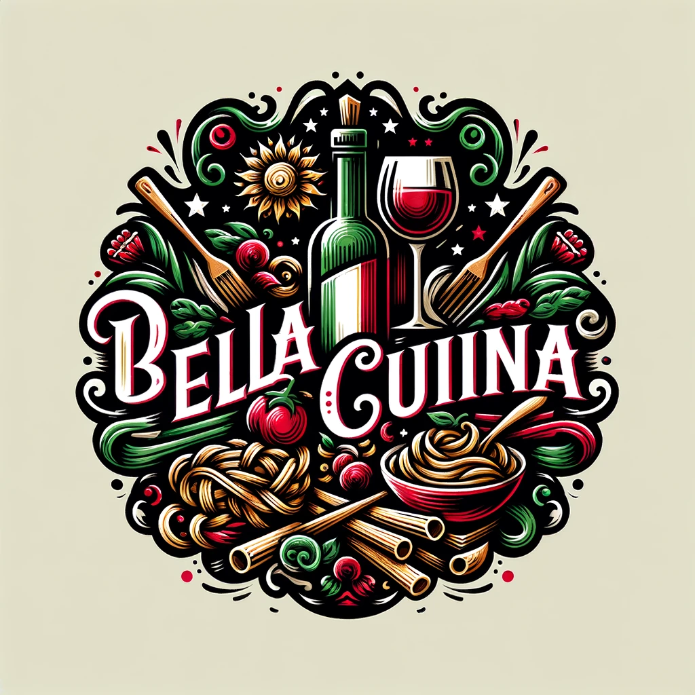

# Bella Cucina - Restaurante Italiano

<p align="center">
  
</p>

## 📋 Sobre o Projeto

Bella Cucina é um site para um restaurante italiano, desenvolvido como parte do Projeto 3 da EBAC (Escola Britânica de Artes Criativas & Tecnologia). O projeto consiste em um site responsivo para divulgar o restaurante, exibir seu cardápio e permitir contato com os clientes.

O site apresenta as seguintes seções:
- **Home/Sobre o Restaurante**: Introdução ao restaurante com carrossel de imagens e texto descritivo
- **Especialidades**: Destaques dos pratos e bebidas especiais do restaurante
- **Cardápio**: Lista detalhada de bebidas, massas, pizzas e sobremesas
- **Contato**: Formulário para os clientes entrarem em contato

## 🛠️ Tecnologias Utilizadas

O projeto foi desenvolvido utilizando as seguintes tecnologias:

- **HTML5**: Estruturação do conteúdo
- **CSS3**: Estilização da página
- **JavaScript**: Interatividade e funcionalidades
- **Bootstrap 5**: Framework para design responsivo
- **Bootstrap Icons**: Biblioteca de ícones

## ✨ Funcionalidades

- **Design Responsivo**: Adapta-se a diferentes tamanhos de tela (desktop, tablet e mobile)
- **Navegação com Rolagem Suave**: Transição suave entre as seções
- **Carrossel de Imagens**: Apresentação visual do ambiente do restaurante
- **Cardápio Interativo com Abas**: Navegação fácil entre diferentes categorias de produtos
- **Formulário de Contato**: Sistema simples para envio de mensagens via email
- **Menu Mobile**: Navegação adaptada para dispositivos móveis

## 🚀 Como Executar

Para visualizar o site, basta abrir o arquivo `index.html` em qualquer navegador web moderno.

```bash
# Clone este repositório
git clone https://github.com/seu-usuario/Projeto-3-Ebac-Restaurante-Italiano.git

# Acesse a pasta do projeto
cd Projeto-3-Ebac-Restaurante-Italiano

# Abra o arquivo index.html no seu navegador
```

## 📱 Responsividade

O site foi desenvolvido com foco em responsividade, adaptando-se a três principais breakpoints:
- **Mobile**: Abaixo de 576px
- **Tablet**: Entre 768px e 991px
- **Desktop**: Acima de 992px

## 👨‍💻 Autor

Este projeto foi desenvolvido como parte do curso da EBAC.

## 📄 Licença

Este projeto está sob a licença MIT. Veja o arquivo LICENSE para mais detalhes. 